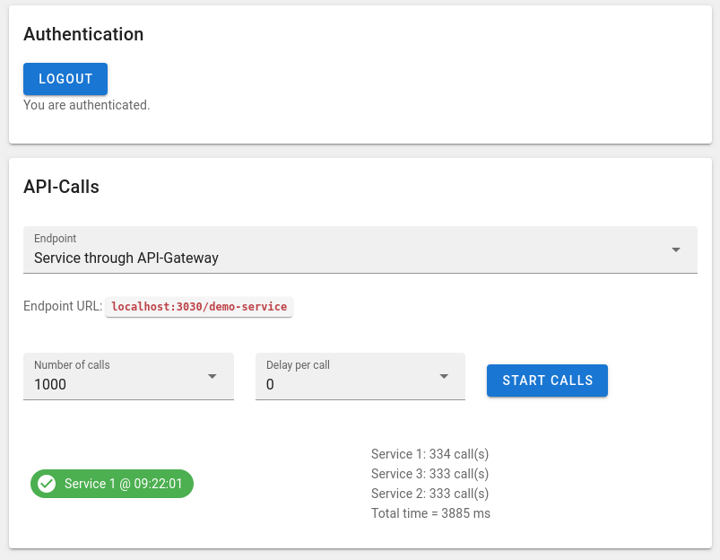

# Demo of a Microservice Network of Feathers Apps

This project demonstrates a microservice network of [Feathers](https://feathersjs.com/) apps. Three copies of the same app are running behind an API gateway:

1. API-Gateway @ ``localhost:3030``
2. Service 1 @ ``localhost:3031``
3. Service 2 @ ``localhost:3032``
4. Service 3 @ ``localhost:3033``

The three services are automatically announced to the gateway via the 
[feathers-distributed plugin](https://github.com/kalisio/feathers-distributed). 
The plugin also realizes load balancing for the calls of the three microservices through the gateway.

The three microservices provide only one simple Feathers service ``demo-service``. It has only the ``GET`` method implemented and accepts just one parameter. If this parameter is set to a value larger than zero, the service response will be delayed by the parameter value in milliseconds. Use this to simulate e.g. a database call. The services respond with a JSON object, containing the name of the service and the datetime of the call. 

This project is similar to the [example project](https://github.com/kalisio/feathers-distributed/tree/master/example) in feathers-distributed, but runs with Feathers 4.


## Launch

To start all apps, just run docker-compose in the project folder:

```
docker-compose up
```

This command will start four Feathers apps called ``api-gateway``, ``demo-service1``, ``demo-service2``, and ``demo-service3`` as Docker containers. The latter three are identical copies of the same app, just their port numbers are different. Also, a client will be compiled and started. You can use the client to call the three services directly or through the API gateway.

## Client 

The client is available under ``localhost:8080``. You can select the endpoint for the API calls, the the number of calls and the delay per call, e.g. for performance testing. The result of the calls is displayed together with the total run time of all calls. 

The API gateway requires authentication. Use the Login button to authenticate with a demo user.
The three services do *not* require authentication, if called directly.



The screenshot is showing the result of 1000 calls to the service ``demo-service`` via the API gateway. All calls to the instances of the demo microservice are nicely balanced (1/3 of the 1000 calls).

BTW: The client is a Vue.js app using the [Vuetify](https://vuetifyjs.com/) UI Library.

## License

Licensed under the MIT license.
